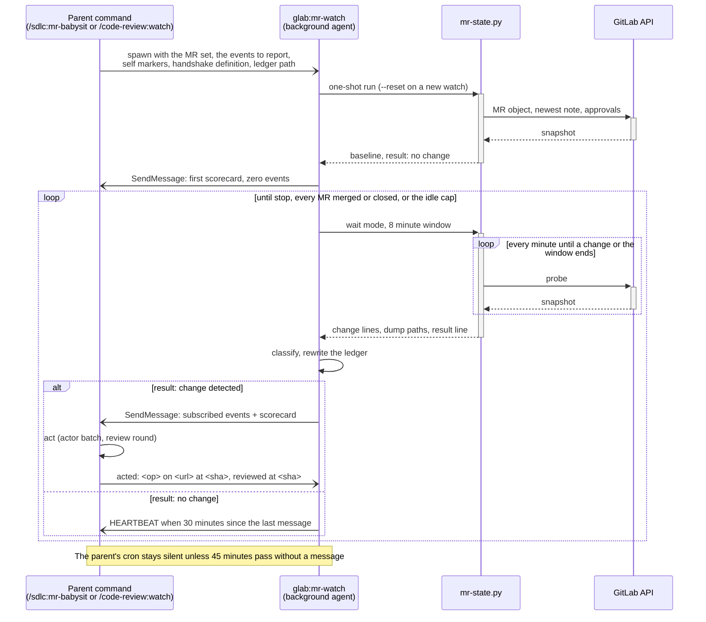

# glab

Claude Code plugin for GitLab through the [glab CLI](https://gitlab.com/gitlab-org/cli). It carries the `glab` skill, the `mr-status` skill with its `mr-state.py` script, the `mr-watch` agent, and slash commands that dump the state of a merge request.

## Requirements

- Claude Code **2.1.0 or newer** (see [Known issue](#known-issue))
- `glab` CLI installed, on PATH, and authenticated via `glab auth login`
- `jq` for JSON processing
- [`glab-discussion`](https://github.com/fprochazka/glab-discussion) for discussion handling (`uv tool install glab-discussion`)
- [`glab-pipeline`](https://github.com/fprochazka/glab-pipeline) for pipeline dumps and triage (`uv tool install glab-pipeline`)

The plugin declares `glab-discussion` and `glab-pipeline` as plugin dependencies, so their skills load alongside it. The CLIs themselves are a manual install. The state script keeps probing without them but cannot fetch threads or pipeline details; it prints a `DEPENDENCY MISSING` line with the install command, and the agent reading it asks you before installing.

## Installation

```bash
claude plugin marketplace add fprochazka/glab-discussion --scope user
claude plugin marketplace add fprochazka/glab-pipeline --scope user
claude plugin marketplace add fprochazka/claude-code-plugins --scope user
claude plugin install glab@fprochazka-claude-code-plugins --scope user
```

## Permissions

Add the following to `~/.claude/settings.json` to allow the skill to load and auto-approve read-only commands:

```json
{
  "permissions": {
    "allow": [
      "Skill(glab)"
    ]
  }
}
```

The skill's `allowed-tools` frontmatter auto-allows read-only commands (`mr list`, `mr view`, `mr diff`, `ci status`, `ci get`, `ci trace`, etc.) and `--help` for all subcommands. Write operations (`mr create`, `mr update`, `mr merge`, `mr note`, `ci run`, `ci retry`, etc.) require manual approval.

The `mr-status` skill and the three commands carry the state script, `glab-discussion read`, `glab-pipeline inspect`, `glab api`, and the read-only `git fetch`, `git rev-list` and `git diff` in their own `allowed-tools`, so a status read and the background watcher run without prompts; the three commands also carry the helper CLIs in full, replies and resolves included, because they act on threads. A prompt that does appear pauses a background watcher until you answer it, so add whatever it asked for to your allowlist.

## Skills

- `glab:glab` — the CLI reference. Merge requests, discussions, pipelines, issues, repositories, releases, variables, schedules, labels, milestones, and the raw API with pagination and GraphQL.
- `glab:mr-status` — how to read a merge request through `scripts/mr-state.py` and how to judge what it prints: the accepted-green set, a pipeline or verdict on a superseded head, profiling each AI reviewer from its own threads instead of assuming how a bot behaves, the newest verdict plus the currently unresolved threads rather than old finding notes, human review separated from the author's own comments, and what blocks the merge right now. See [`skills/mr-status/SKILL.md`](skills/mr-status/).

## The state script

`scripts/mr-state.py` is one Python file, standard library only, that every reader in this plugin goes through:

- `mr-state.py` reads the MR of the current branch; `--mr-url <url>`, repeated, reads a set across repos and hosts.
- Every run remembers what it saw under `<tmp>/glab-state/<host>/<project>/mr-<iid>/` and prints what changed since the last run: state, draft, head, pipeline, rebase distance, merge status, notes, reviewers, assignees, labels, approvals. The first run establishes a baseline. It prints the diff, flushes, and only then advances the stored state, so a run killed in between reports the same change again rather than losing it.
- `--wait-for-state-change-timeout-minutes N` probes every minute and exits on the first change or on the timeout, and its last line says which. A probe is two API calls per MR, the MR object and the newest note by `updated_at`, plus approvals when the MR's `updated_at` moved. A read that fails for one MR is reported and the others still read; the exit code is non-zero only when nothing could be read at all. The discussion dump runs only when a note moved, the pipeline dump only when the pipeline moved.
- `--all`, `--comments`, `--pipeline` narrow a one-shot read; `--pipeline` also forces a fresh pipeline dump when the pipeline did not move. `--reset` forgets the stored state.

Transient GitLab values (`merge_status: checking`, a rebase in progress) are held at their last settled value, not reported as changes. Its unit tests run under `make test`.

## The watcher agent

`glab:mr-watch` is an agent definition that `/sdlc:mr-babysit` and `/code-review:watch` spawn in the background. It preloads `mr-status`, runs the state script in wait mode in a loop, interprets every change, and reports it to the session that spawned it through `SendMessage` without ending its turn. It never acts on an MR. The parent tells it which events to report, which comment markers are its own, how its team defines who holds the ball (the draft flag is one convention, not a rule), and, when it wants ticket-state events, which tracker skill to load. See [`agents/mr-watch.md`](agents/).

### How a watch runs

The parent spawns the watcher once and is idle until a message arrives. The watcher never returns; every finding is a `SendMessage`, and the parent answers with acks so its own moves do not come back as events.



## Commands

Each command runs the state script for the MR of the current branch, as `glab` detects it, and dumps its state into files before Claude reads anything. None of them changes code.

### `/glab:overview`

Fetches the full MR state — pipeline, comments, external statuses — and presents a status overview without taking any action. Pipeline triage reads the `glab-pipeline` summary and opens a job log only when a job failed.

### `/glab:comments`

Fetches only MR comments, analyzes them, and proposes what to do about the unresolved threads. It also re-reads the resolved threads, because AI reviewers post findings that land there and a resolved thread does not prove the problem is fixed.

### `/glab:pipeline`

Dumps the pipeline through `glab-pipeline inspect`, triages the failed jobs, and proposes fixes. The command tells Claude to read the summary first and then only the job logs, test report, or lint output that the summary points at.

## How it works

The state script backs all three commands:

1. Resolves the MR from the current git branch through `glab mr view`, or from the URLs given
2. Reads the MR object and the newest note through `glab api`, compares them with the stored state, and prints the diff
3. Delegates discussion fetching to `glab-discussion read --dump` (per-thread files with incremental updates, bot detection, diff note positions)
4. Delegates the pipeline to `glab-pipeline inspect --mr-url <url>` (jobs, every job trace, and the conditional lint, test-report, and downstream fetches)
5. Adds the external commit statuses, which live on the commit rather than in the pipeline, so `glab-pipeline` does not report them

Output, under `<tmp>/glab-state/<host>/<project>/mr-<iid>/`:

- `state.json` — the last snapshot, `mr.json` — the raw MR object from the last probe, `events.log` — every change printed, UTC
- `pipeline-summary.txt` and `pipeline/` — the `glab-pipeline` dump: `summary.json`, `pipeline.json`, `jobs.json`, `job-logs/<stage>-<name>-<id>.log`, and `lint.json`, `merged.yml`, `test-report.json`, `downstream/` when they apply
- `external-statuses.json`
- `/tmp/glab-discussion/<host>/mr-<iid>/*.txt` — one file per discussion thread, managed by `glab-discussion`

## Related

The unattended loop that drives an MR to green — rebase, fix CI, answer comments — lives in the [`sdlc`](../sdlc/) plugin as `/sdlc:mr-babysit`, and the reviewer side in the [`code-review`](../code-review/) plugin as `/code-review:watch`. Both spawn this plugin's `mr-watch` agent to do the watching.

## Known issue

These commands need Claude Code 2.1.0+ because of a [bug in older versions](https://github.com/anthropics/claude-code/issues/9354) where `${CLAUDE_PLUGIN_ROOT}` was not substituted in plugin `allowed-tools` frontmatter. If you see `Error: Bash command permission check failed`, upgrade Claude Code.

## Author

Filip Procházka

## License

MIT
